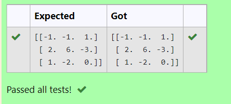

# INVERSE-OF-A-MATRIX
## Aim:
To write a python program to find the inverse of a matrix
## Equipment’s required:
1. 	Hardware – PCs
2. 	Anaconda – Python 3.7 Installation / Moodle-Code Runner
## Algorithm:
### Step 1: Import numpy as np.
### Step 2: Assign np.array() in inverse of a matrix.
### Step 3: Using the np.linalg.inv() we can find the inverse of a matrix.
### Step 4: Add the coding and end the program.

## Program:
```
import numpy as np
A=([[6,2,3],[3,1,1],[10,3,4]])
inverse=np.linalg.inv(A)
print(inverse)
```
## Output:

## Result:
Thus the inverse of given matrix is successfully solved using python program

